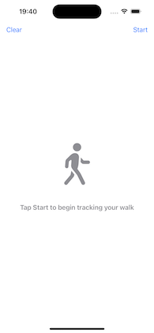
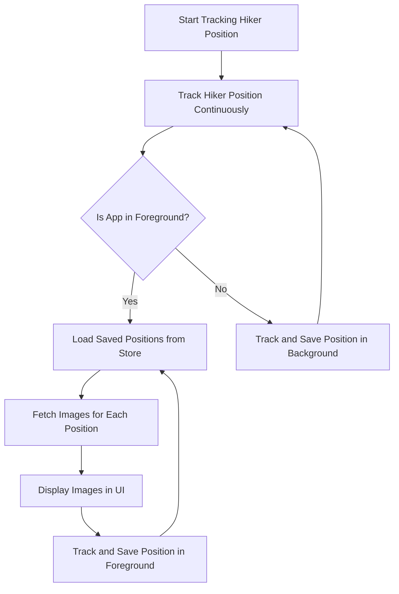

# iOS Hiker App

An application that tracks the hiker's position in the background and creates a photo stream based on those locations.

| **Empty Hike Tour**                      | **Request Location**                     | **Decline Permission**                   | **Loading Image for Location**      |
|------------------------------------------|------------------------------------------|------------------------------------------|-------------------------------------------|
|  |  |  |   |

## App Logic Flow Idea

- **Continuous Tracking**: The app tracks the user's location continuously, whether it is in the foreground or background.
- **Separation of Concerns**: Location tracking is independent of image fetching.
- **Foreground-Only Image Loading**: Images are only fetched and displayed when the app is in the foreground.

## Implementation Details

- **Flickr API**: The app utilizes the [flickr.photos.search](https://www.flickr.com/services/api/flickr.photos.search.html) endpoint for fetching images based on location. Although this endpoint may return the same photos for different locations, I chose to avoid to use another endpoint to focus on location tracking, general photo loading, and displaying the photo stream.
- **Testing in Xcode**: Therefore it's recommended to test location changes and the image loading behavior over the Xcode "Simulate Location" feature.

## Learnings / Challenges

- **Unreliable Data Sources**: Managing unreliable data sources, such as user positions, is a challenge best addressed with robust automated test cases (see Open Points).
- **User Permissions**: Handling user permissions accurately is crucial to ensure the app reflects the current status to the user correctly.
- **State Management**: Technical state management within the app is essential to consistently display the correct state to the user.
- **Data Caching**: Caching external data is necessary to support fast re-rendering of the layout. 

## Open Points

- **Global Loading State**: A coordinated approach to loading API data and images needs to be implemented. This includes limiting parallel requests and centralizing error handling from the server.
- **Testing**: Automated tests are currently missing. However, the use of protocols should facilitate the creation of abstracted tests for each sub-component.
- **Error Handling**: Proper interception of incorrect image loading has yet to be implemented.
- **Permission Handling**: The app needs to handle permission changes dynamically while the user is on a hike.
